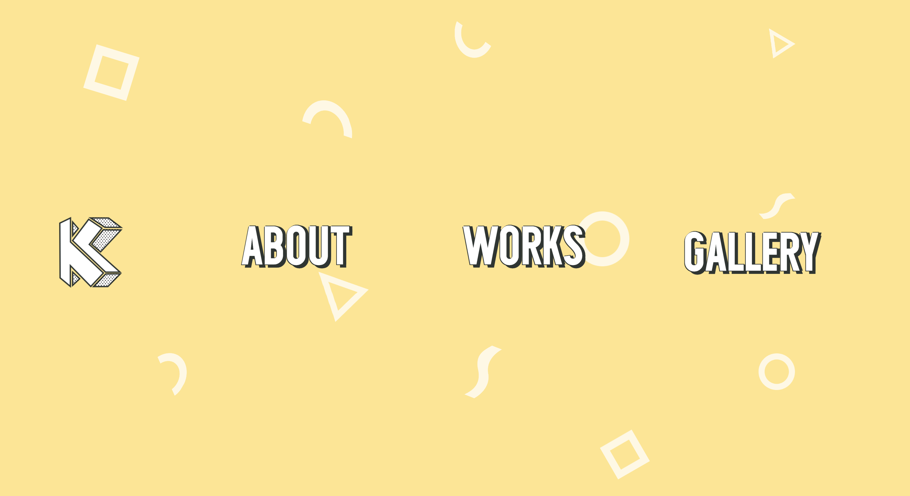

# Kota Enokida Personal Portfolio V3

kotaenokida.netlify.app is the third iteration of my personal portfolio website. The website is built with Gatsby.js to boost performance. GraphQL is used to query and render project information. 

  

## How it was made

- Gatsby.js
- GraphQL
- React Hooks

## What I learned

While developing this project, I learned more about SVG animations and using React Hooks to change child/parent components. This project was also a good practice for GraphQL to query JSON and render components. 